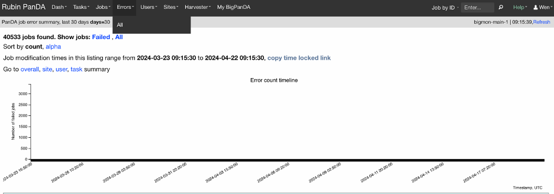
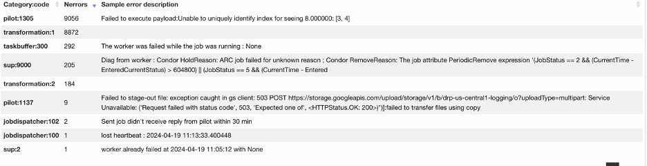

Boost Memory
============

Add PanDA rules to boost memory
-------------------------------

The retry_action is defined in https://panda-wms.readthedocs.io/en/latest/advanced/job_retry_module.html.
We need to add rules in the PanDA database to boost memory.

- Login to panda database to get the current retryaction_id and retryerror_id.
  Here are instructions::

      select * from retryactions
      select * from retryerrors

- Find different transExitCode, pilotErrorCode or other PanDA jobs' error information for boost memory.
  To find the error codes, one way is from user reports (users report some error jobs). Another way is to
  analyse the job errors for a time period. For example, in the PanDA monitor page, click the 'Errors" (the
  top menu line). PanDA will list all recent errors (sometimes you may need to add **&days=30** in the URL
  to show more jobs). After that, you can scroll down to the **Overall error summary** section. Here you can
  click the item under **Category:code**. You will be redirected to a page that lists jobs with that error.
  (Frequently jobs with memory issues fail with some messages with words *memory*, *kill*, *lost* and so on).

- Add rules to boost memory.
  For Rubin, we found that **exeErrorCode:137** and **pilotErrorCode:1212** are caused by run out of memory.
  Here are instructins::

    insert into retryactions(retryaction_id, retry_action, active, retry_description) values (1, 'increase_memory_xtimes', 'Y', 'Job ran out of memory. Increase memory setting for next retry.');
    insert into retryerrors(retryerror_id, errorsource, errorcode, errordiag, active, retryaction, description) values(1, 'taskBufferErrorCode', 300, '.*The worker was finished while the job was starting.*', 'Y', 1, 'increase memory');
    insert into retryerrors(retryerror_id, errorsource, errorcode, active, retryaction, description) values(1, 'exeErrorCode', 137, 'Y', 1, 'increase memory');
    insert into retryerrors(retryerror_id, errorsource, errorcode, active, retryaction, description) values(2, 'pilotErrorCode', 1212, 'Y', 1, 'increase memory');

- To monitor the logs in panda server (not jedi)::

      ls /var/log/panda/panda-RetrialModule.log
