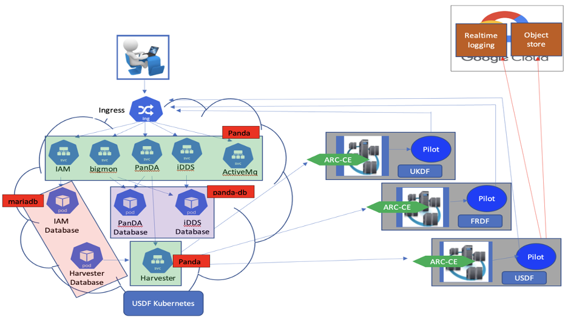

PanDA Production @ USDF
=======================

The PanDA k8s deployment includes these components below. The PanDA system is deployed to USDF k8s cluster
through ``helm``. In this chapter, the details about how to deploy the PanDA Production system at USDF are described.

- **PanDA**. PanDA server, JEDI and postgres database.
- **iDDS**. The iDDS (restful service and daemon agents are in one pod) and postgres database.
- **Harvester**. Harvester and mariadb.
- **PanDA monitor**. The monitor.
- **Indigo IAM**. The IAM to manage OIDC user registration and user accounts. Optional.
- **ActiveMQ**. The messaging service.

Setup
-----
Setup environment to access the ``usdf-panda`` k8s cluster.

- Get the tokens to authenticate usdf-panda cluster https://k8s.slac.stanford.edu/usdf-panda. Login to it to get instructions
  to setup environment for ``usdf-panda``.

- Follow the instructions to setup the environments in a USDF bash environment, such as SLAC ``rubin-dev``.

Deploy secrets
--------------
Currently the secrets are in ``BitBucket`` private git repo, please contact the PanDA team to get the secrets.

Instructions to deploy the secrets::

    helm install/upgrade panda-secrets -n panda secrets_prod/  -f secrets_prod/values.yaml -f secrets_prod/values-secret.yaml
    helm install/upgrade panda-secrets -n mariadb secrets_prod/  -f secrets_prod/values.yaml -f secrets_prod/values-secret.yaml

Main deployment
---------------
Checkout the main deployment scripts::

    git clone https://github.com/PanDAWMS/panda-k8s.git
    cd panda-k8s

Mariadb deployment::

    kubectl create namespace mariadb
    helm repo add mariadb-operator https://mariadb-operator.github.io/mariadb-operator
    helm install -n mariadb mariadb-operator mariadb-operator/mariadb-operator

    # iam-db
    helm install -n mariadb iam-db helm/mariadb/iam-db/ -f helm/mariadb/iam-db/values.yaml  -f helm/mariadb/iam-db/values/values-lsst-prod.yaml

    # harvester-db: multiple instances
    helm install -n mariadb harvester-db-0 helm/mariadb/harvester-db/ -f helm/mariadb/harvester-db/values.yaml  -f helm/mariadb/harvester-db/values/values-lsst-prod.yaml
    helm install  -n mariadb harvester-db-1 helm/mariadb/harvester-db/ -f helm/mariadb/harvester-db/values.yaml  -f helm/mariadb/harvester-db/values/values-lsst-prod.yaml

Services deployment::

    # helm install -n panda iam helm/iam/ -f helm/iam/values.yaml -f helm/iam/values/values-lsst-prod.yaml
    helm install -n panda msgsvc helm/msgsvc/ -f helm/msgsvc/values.yaml -f helm/msgsvc/values/values-lsst-prod.yaml
    helm install -n panda panda helm/panda/ -f helm/panda/values.yaml -f helm/panda/values/values-lsst-prod.yaml
    helm install -n panda idds helm/idds/ -f helm/idds/values.yaml -f helm/idds/values/values-lsst-prod.yaml
    helm install -n panda harvester helm/harvester/ -f helm/harvester/values.yaml -f helm/harvester/values/values-lsst-prod.yaml
    helm install -n panda bigmon helm/bigmon/ -f helm/bigmon/values.yaml -f helm/bigmon/values/values-lsst-prod.yaml

