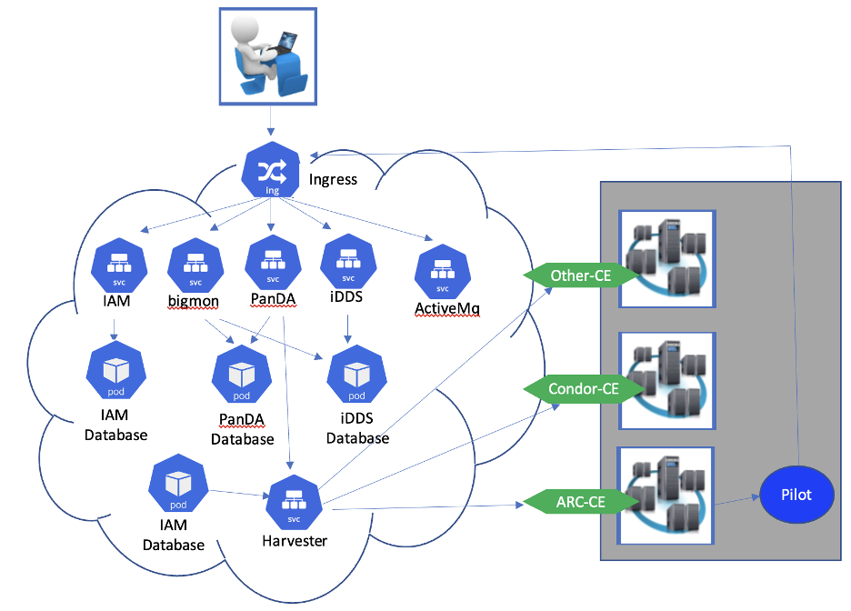

PanDA Kubernetes deployment
=============================

The PanDA system supports kubernetes (k8s) deployment.

K8s basic
----------
A service ca be deployed into a k8s by 'deployment' or 'stateffulset'. A 'deployment' or 'statefulset'
includes one or more pods, which can includes a 'service' to export the services (such as http) to the
k8s cluster. An 'ingress' can be configured to export the 'service' from k8s to outside.

PandDA k8s
----------

The PanDA k8s deployment includes these components:

- **PanDA**. PanDA server, JEDI and postgres database.
- **iDDS**. The iDDS (restful service and daemon agents are in one pod) and postgres database.
- **Harvester**. Harvester and mariadb.
- **PanDA monitor**. The monitor.
- **Indigo IAM**. The IAM to manage OIDC user registration and user accounts. Optional.
- **ActiveMQ**. The messaging service.

