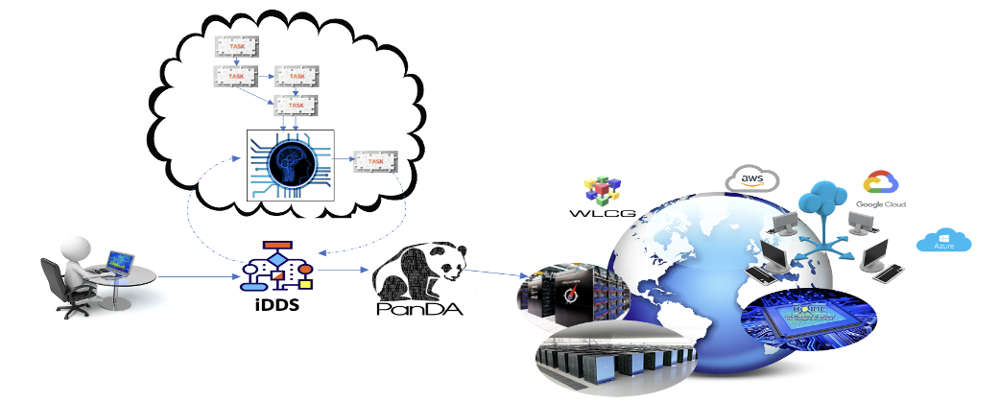
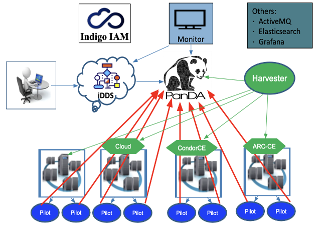
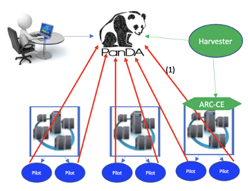
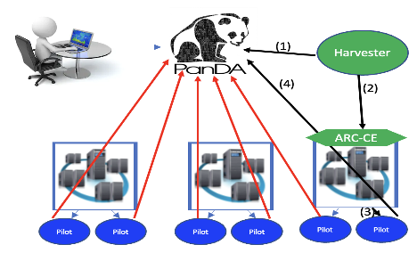

PanDA system
============

A general overview of the PanDA system.

PanDA
-----

Details see 'PanDA <https://panda-wms.readthedocs.io>'.

The Production and Distributed Analysis (PanDA) system is a distributed workload management system.
Distributed Users from different universities/labs can run jobs on PanDA through a http service, with
X509 or OIDC for authorization. It provides a general interface for users.It integrates distributed
heterogeneous computing resources from diverse locations with different software. It integrates
different resource providers(Grid, Cloud, k8s, HPC and so on), It hides the diversities of resource
providers from users.

iDDS
----

Details see 'iDDS <https://idds.readthedocs.io>'.

The intelligent Data Delivery Service (iDDS) is a workflow management orchestration system.
It coordinates and orchestrates tasks and data, streamlines operations into a workflow to
improve automation and efficiency. It supports Directed Acyclic Graph (DAG) management,
Condition workflow and Loop workflow management, and asynchronous result delivery.

PanDA-iDDS components
---------------------

A general overview of the PanDA components.

- **PanDA**. PanDA is the workload manager. It manages/schedules tasks and jobs.
  It includes panda-server (job management), panda-JEDI (task management)
  and panda-database (postgresql for LSST).

- **iDDS**. iDDS is the workflow manager. It manages the dependencies of tasks and jobs.
  It includes the Restful service, the daemon agents and the database (postgresql for LSST).

- **Harvester**. It's the resource facing service to submit jobs to Grid/Cloud. It submittes jobs to CEs,
  such as Cloud, CondorCE, ARC-CE and others. It includes the Harvester service and a Mariadb.

- **Pilot**. The pilot runs as an agent at remote worker nodes to manage the user payload execution.

- **Monitors**. The main monitor is a PanDA monitor. It can also be integrated with Grafana, ElasticSearch.

- **Messaging**. The system employs a messaging service, for example ActiveMQ, to communicate between each other.

- **Indigo IAM**. The Indigo IAM is employed to manage OIDC based authentication and authorization operations.

Authentication/Authorization
----------------------------
The system supports both X509 and OIDC (with Indigo IAM) for authentication and authorization.

PanDA modes
-----------

The PanDA system supports ``pull`` mode and ``push`` mode.

PULL
~~~~

In the ``pull`` mode, at first the Harvester sends a few pilots before any jobs to make sure
that the system is ready for jobs. The harvester checks the number of jobs in PanDA to decide
how many pilots to be submitted to CEs (Computing Element) , such as ARC CEs. The CE accepts and starts pilots in
the local cluster. When a pilot starts to run, it pulls user payloads from the PanDA server and
manages to run the user payloads.

In ``pull`` mode, the pilots start before the user payloads. If the local cluster system has some problem
to starts the pilot, the user payload will not be touched. The pilot works as a pioneer to find general errors.
In this mode, the resource requirements are standardized, for example 4GB/8GB/12GB memory. For a user payload
requiring 6 GB memory, it may be scheduled to a pilot with 8GB memory.

In ``pull`` mode, one pilot can run multiple user payloads by sequences.

The ``pull`` mode:

- For pull mode, PanDA will submit empty pilots to the cluster maybe even
  before the user jobs are submitted. When the pilot starts to run, pilot
  will pull the user jobs to run.

- In pull mode, pilot will be submitted with the maxRSS of the PanDA queue.
  So for a user job with "requestMemory: 5000", it will be scheduled to
  SLAC_Rubin_medium. For SLAC_Rubin_medium queue, the pilot will be submitted
  with 8GB. So this user job can use in fact no more than 8GB memory (Even
  the requestMemory is 5GB, in this case it can use no more than 8GB before
  it's killed).

- For pull mode, one pilot can run multiple user jobs. So different user jobs
  requested 5GB, 6GB or 7GB are possible to go to the same pilot. It's an
  efficient way for short jobs. For short jobs, pull mode saves a lot of
  environment setup time.

- For pull mode, when there are no user jobs. PanDA may still submit a few
  pilots to keep the system ready for user jobs(1~3 pilots normally. It depends
  on the configuration. If you want the system to have a lot of pilots ready
  at any time, the configured number can be high). When there are user jobs,
  PanDA starts to boost to submit more pilots.

PUSH
~~~~

In the ``push`` mode, the Harvester fetches the user payload at first and parses the resource requirement
of the user payload. Then it submitts a pilot with the special user's resource requirements, attached
with the user payload to CEs. When pilot starts, it will starts the attached user payload.

In ``push`` mode, the user payload is attacched together with a pilot. The resource requirements are exactly
based on the user payload's requirements. However, if the local cluster system has some
problem to start the pilot, the user payload will fail too. At the same time, one pilot can run only
one user payload.

The ``push`` mode:

- For push mode, pilot is submitted together with a user job (not before the
  user job). For push mode, one pilot is bound with one user job. In this
  mode, one pilot will only run that one job before it exits and the slurm
  job completes.

- Since the pilot is submitted after the user job is created, pilot will be
  submitted with the exact requestMemory of the job. For example, if a user
  job requests 20GB memory. The job will be scheduled to  SLAC_Rubin_Extra_Himem.
  If this queue was pull mode, the pilot would be submitted with 220GB (the maxRSS).
  However, since this queue is push mode, the pilot will be submitted with
  the requestMemory 20GB.

