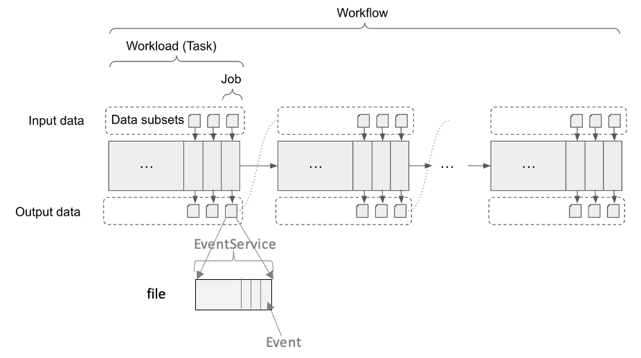
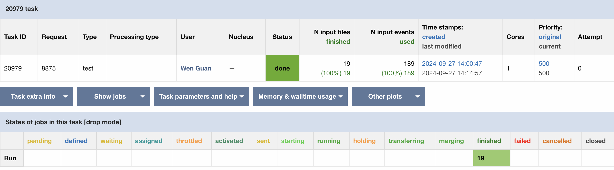
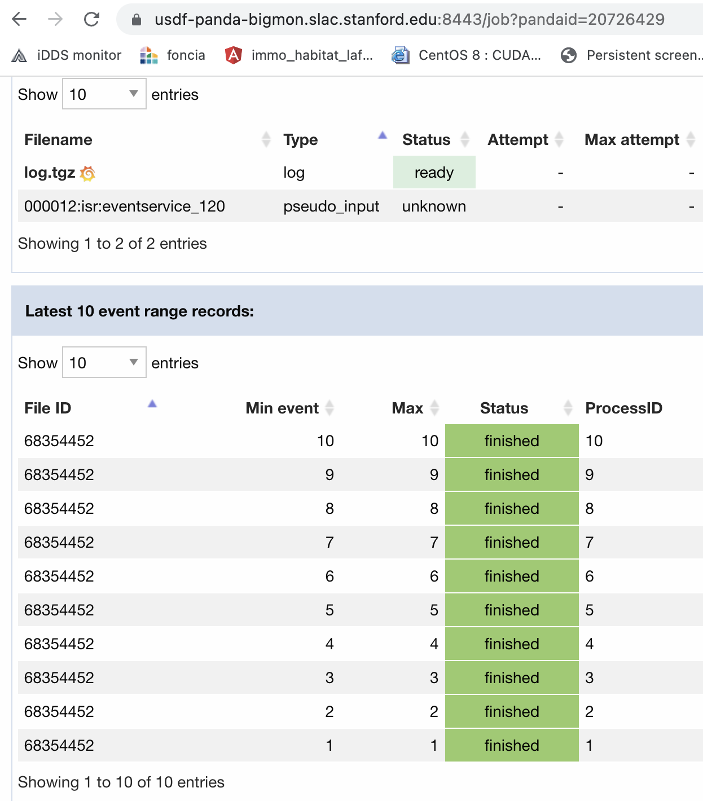
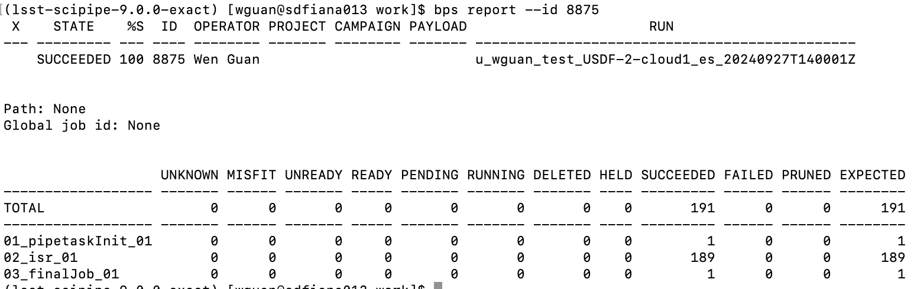

.. _event_service:

EventService
============

Workflow
------------

Here is the structure of workflow.

- **Workflow**. One workfow corresponds to a scientifc objective with one or multiple intermediate steps.
  A workfow is comprised a group of constituent tasks and their topological relationship.

- **Task**. A task is a software program or application that utilizes computing resources to achieve one
  of the intermediate steps in a workfow. It normally processes a set of data.

- **Job**. A job is a PanDA object with distinct states that corresponds to a sub-unit of a task. A single
  task consists of multiple jobs, and each job is executed by a worker, which is an abstraction of the
  execution point, such as a worker node and CPU cluster. A job can process a list of files, a file or
  a part of one file. In ATLAS experiment, one file normally stores many ordered events (particle objects).
  One job can process a part of the events, for example 0~1000 events for the first job and 1000~2000 for
  another job. In the job level, the events are processed in order in one sequence. If one of the events
  fails, the job will fail (Generally EventService is not enabled. Job is the basic unit for bookkeeping.
  Without event level bookkeeping, all events need to be processed in order and an event failure will fail
  the job). In addition, a PanDA jo is the basic unit that a pilot runs.

- **EventService**. EventService introduces another bookkeeping level which split a job into a fine-grained
  processing level. With EventService, the bookkeeping and retrying policy can be based on events. When
  EventService is enabled, the events in a file can be processed discretely. The event failure will be
  recorded and will not fail the attached job.

Overheads in Job Scheduling
---------------------------

During job scheduling, there are overheads at many places. If the payload is too small, the overhead
may be a big part from the payload submitted to the output returned back to users. It's good to make
sure the payload not too small.

- **scheduling period**. The basic scheduling loop is normally similar to the script described below.
  Normally the scheduler should sleep a period between different scheduling loops. Without a sleep
  period, it will make all system busy and not efficient. If checking the configuration of a
  workflow/workload system such as Condor, Slurm, BPS, ARC CE, PanDA, Harvester and iDDS, you will
  find the interval period defined in different systems. By default, the interval period normally
  can be 30 seconds or 1 minute. When the system is big with many resources and users, the interval
  period can be even bigger. At the same time, frequently there are multiple agents or threads in
  one system. Different agents and threads have different interval periods too. If one job involves
  many systems, such as iDDS->PanDA->Harvester->ARC CE->Cluster(Slurm, Condor, etc)->Pilot, and many
  agents/threads in one system, the total overhead can be big. ::

    while not terminated:
      schedule_jobs()
      sleep(interval_period)

- **Processing overhead**. For a payload, when it begins, it needs some steps to setup the environment.
  When it ends, it needs some time to transfer the outputs/logs to some storages. It also takes some time.

- **PanDA optimization for overheads**. (1) To avoid the overheads between PanDA->Harvester->ARC CE->
  Cluster(Slurm, Condor, etc)->Pilot, PanDA introduces the 'PULL' mode that one Pilot can run multiple
  payloads and the Pilot gets payloads from PanDA directly after pilot starts. The path for 'PULL'
  mode is PanDA->Pilot. (2) To avoid setting up environment and uploading logs too many time,
  EventService can simplify it (EventService also simplify the scheduling in PanDA server).

EventService
------------

How does EventService run:

- In EventService, events are placed in a file which is attached to one or multiple jobs.

- Here is how Pilot process multiple events when using EventService::

    (pilot)
    get_job
    setup_job
    while more_events_for_a_job:
      get_event
      process_event
      update_event_status_to_panda
    terminate_job
    upload_logs

EventService introduces a fine-grained scheduling level with bookkeepings. EventService is managed as
part of a job. It has less scheduling overheads.

- EventService is managed as part of a job. It's similar to Pilot 'PULL' job, in which the scheduling is
  between PanDA and pilot. It skips Harvester, ARC CE and Cluster system like Slurm.

- Comparing to job, EventService has one setup to setup the job, then run multiple events, and at the end
  only transfer one log file for the job. It reduces the setup time, log transferring time and so on.

EventService for Rubin
----------------------

EventService for ATLAS is mainly used for fine-grained simulation processing, in which it normally takes
6~10 minutes to simulate an event. For Rubin, some jobs are too short which introduce huge overheads and
loads in scheduling and logs transferring. EventService is one mechanism to reduce the overheads and
loads on different involved systems, without cutting the bookkeeping requirements in Rubin.

How to map Rubin payloads to EventService:

- During workflow submission time, BPS PanDA plugin defines a mapping file to manage the mapping between event number and
  the Rubin payload job. For example::

    {
    'pipetaskInit': {'0': 'pipetaskInit_0'},
    'isr': {
            '0': 'isr_payload_0',
            '1': 'isr_payload_1',
            ...
            '1000': 'isr_payload_999'},
     'final': {'0': 'final_payload_0'}
     }

- Here for example, EventService is enabled for the 'isr' step, with 100 events per job. PanDA will manage
  the event number 0~999 and split it into 10 jobs, job0: 0~99, job1: 100~199, ..., job9: 900~999.

- Pilot starts a job, for example job1. Pilot will get an event from PanDA and will use the mapping file
  to map the event number to a Rubin payload.

How to run EventService
~~~~~~~~~~~~~~~~~~~~~~~

To enable EventService, users only need to define these values below in bps submission yaml files, which
can be found in this file ${CTRL_BPS_PANDA_DIR}/config/bps_panda_eventservice.yaml.::

  # enable EventService to have multiple payloads per PanDA job

  # list of bps job labels to enable EventService
  enableEventService: isr,step1

  # When EventService is enabled, if requestWalltime and maxWmsJobWalltime are defined,
  # max_payloads_per_panda_job = int(maxWmsJobWalltime / requestWalltime)
  # Otherwise max_payloads_per_panda_job = int(maxPayloadsPerPandaJob)
  maxWmsJobWalltime: 21600
  maxPayloadsPerPandaJob: 10

EventService monitor
--------------------

Here is an example in which EventService is enabled for the 'isr' step. In this example, the 'isr' step
has 189 payload jobs. With EventService, the 189 payloads are mapped to 189 events. It's splitted with
10 events per PanDA job, as shown in the task monitor page.

Here is the job monitor page. When EventService is enabled, the event status can be found in this page.

For EventService jobs, PanDA and iDDS automaitcally manages the mapping between PanDA events and
'bps report'. The result of 'bps report' keeps the same as no EventService is enabled.

