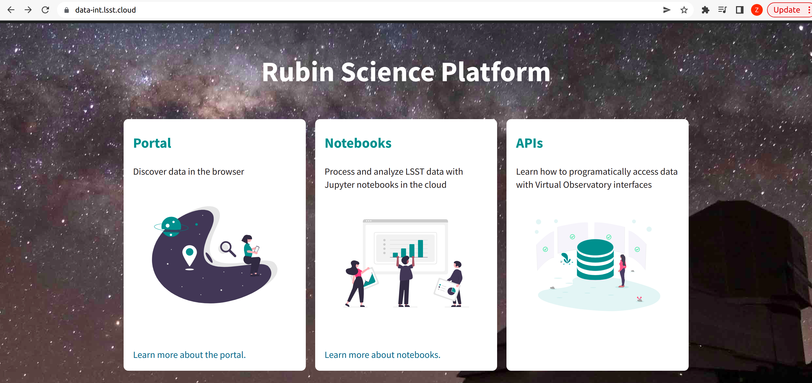

.. How to submit a workflow (remotely)

How to submit a workflow (remotely)
===================================

**Here are instructions how to submit a PanDA workflow to remote sites**.

**To submit a workflow locally, please check :ref:`How to submit a workflow (locally or developer)`**

To submit a workflow to PanDA system, here are several general notes:

- **setup environment**. To seupt workflows from USDF, FrDF and UKDF,
  we use the cvmfs to setup the environments. To submit workflows from IDF,
  we can only run remote submission.

- **YAML configuration**. The YAML configuration for BPS submission.

- **butler configuration**. For remote submission, users don't need to configure
  butler. The site admin will configure it for you.

- **remote submission**. In the remote submission, the YAML configuration files
  will be transfered to remote sites (Even the submission is from USDF to USDF is
  considered a remote submission). All steps, including the Quantum Graph generation
  are executed in the PanDA jobs. With remote submission, there will be no permission
  issue on Quantum Graph directory if a user is using the default configuration (without
  overwritting **fileDistributionEndPoint**).

Setup environment
-----------------

Setup environment with CVMFS
~~~~~~~~~~~~~~~~~~~~~~~~~~~~

The submit workflows from USDF, FrDF and UKDF, the CVMFS is available. Users can use
CVMFS to setup the environments::

  latest=$(ls -td /cvmfs/sw.lsst.eu/linux-x86_64/panda_env/v* | head -1)
  source $latest/setup_lsst.sh <lsst stack version>
  # source $latest/setup_lsst.sh w_2024_14   # for example
  source $latest/setup_panda.sh

For LSST stack verion older than w_2024_14, this line below is required for remote submission::

  source $latest/setup_bps.sh

Setup environment on IDF
~~~~~~~~~~~~~~~~~~~~~~~~

The Rubin Science Platform (RSP) can be accessed from the JupyterLab
notebook configured for the IDF at: ::

    https://data-int.lsst.cloud/

Choose "Notebooks" and authorize lsst-sqre with your user credentials.
After successful authentication, choose a cached image or the latest weekly
version (recommended) from the drop down menu.

Open a terminal (menu **File > New > Terminal**).

On IDF, CVMFS is not available. However, on IDF, normal environments should already be setup.
Users only need to run this command below after login to data-int.lsst.cloud or data.lsst.cloud. ::

    setup lsst_distrib

**IDF can only run remote submission currently, to submit workflows to USDF, FrDF or UKDF.**

Ping PanDA Service
~~~~~~~~~~~~~~~~~~

After setting up the environment, users can try to ping PanDA service to make sure the settings are ok.

If the BPS_WMS_SERVICE_CLASS is not set, set it through::

   $> export BPS_WMS_SERVICE_CLASS=lsst.ctrl.bps.panda.PanDAService

Ping the PanDA system to check whether the service is ok::

   $> bps ping

**In this step, it will look for tokens for authorization. If you don't have a token or you are not registered yet,
please check :ref:`user_authentication`.**

Prepare YAML configuration
--------------------------

YAML configuration
~~~~~~~~~~~~~~~~~~

As any other Rubin workflow submitted with BPS commands, PanDA based
data processing requires a YAML configuration file. The YAML settings,
common for different BPS plugins provided here::

    https://pipelines.lsst.io/modules/lsst.ctrl.bps/quickstart.html#defining-a-submission

Later in this section we focus on PanDA specific and minimal set of the
common settings supplied in the YAML with *bps submit <config>.yaml*
command. They are::

   -  maxwalltime: 90000 maximum wall time on the execution node allowed to
      run a single job in seconds

   -  maxattempt: 1 number of attempts to successfully execute a job. It is
      recommended to set this parameter at least to 5 due to preemptions
      of machines used in the GKE cluster

   -  whenSaveJobQgraph: "NEVER" this parameter is mandatory because PanDA
      plugin is currently supports only a single quantum graph file
      distribution model

   -  idds_server: "https://aipanda015.cern.ch:443/idds" this is the URL of
      the iDDS server used for the workflow orchestration

   -  sw_image: "spodolsky/centos:7-stack-lsst_distrib-d_2021_08_11"
      defines the Docker image with the SW distribution to use on the
      computation nodes

   -  fileDistributionEndPoint:
      "s3://butler-us-central1-panda-dev/hsc/{payload_folder}/{uniqProcName}/"
      this is bucket name and path to the data used in the workflow

   -  s3_endpoint_url: "https://storage.googleapis.com" the address of the
      object storage server

   -  payload_folder: payload name of the folder where the quantum graph
      file will be stored

   -  runner_command. This is the command will be executed in container by
      the Pilot instance. The ${{IN/L}} expression is the PanDA
      substitution rule to be used during jobs generation.

   -  createQuantumGraph: '${CTRL_MPEXEC_DIR}/bin/pipetask qgraph -d
      "{dataQuery}" -b {butlerConfig} -i {inCollection} -p
      {pipelineYaml} -q {qgraphFile} {pipelineOptions}' this command
      does not contain any PanDA specific parameters and executes at the
      submission node on the local installation

   -  runQuantumCommand: '${CTRL_MPEXEC_DIR}/bin/pipetask --long-log run -b
      {butlerConfig} --output-run {outCollection} --qgraph
      {fileDistributionEndPoint}/{qgraphFile} --qgraph-id {qgraphId}
      --qgraph-node-id {qgraphNodeId} --skip-init-writes --extend-run
      --clobber-outputs --skip-existing' in this command we replace the
      CTRL_MPEXEC_DIR on container_CTRL_MPEXEC_DIR because it will be
      executed on the computation node in container

After implementing lazy variables there is not container release
specific variables in the YAML file.

Site&Memory requirements in YAML files
~~~~~~~~~~~~~~~~~~~~~~~~~~~~~~~~~~~~~~

  * Only request memory and let PanDA do the scheduling(do not define *queue*).
    Here is an example::

       computeCloud: "US"
       computeSite: "SLAC"
       requestMemory: 2048

       pipetask:
           pipetaskInit:
               requestMemory: 4000

       executionButler:
           requestMemory: 4000

  * Another example by specifying queues (Here a *queue* is defined)::

       computeCloud: "US"
       computeSite: "SLAC"
       requestMemory: 2048

       pipetask:
           pipetaskInit:
               requestMemory: 4000

           forcedPhotCoadd:
               # *requestMemory is still required here.*
               # *Otherwise it can be schedule to the merge*
               # *queue, but the requestMemory is still 2048*
               requestMemory: 4000
               queue: "SLAC_Rubin_Merge"

Example YAML configuration for remote submission
~~~~~~~~~~~~~~~~~~~~~~~~~~~~~~~~~~~~~~~~~~~~~~~~

Here is an example for remote submission::

    LSST_VERSION: w_2024_14

    includeConfigs:
      - ${CTRL_BPS_PANDA_DIR}/config/bps_panda_DF.yaml
      - ${CTRL_BPS_PANDA_DIR}/config/bps_remote.yaml

    pipelineYaml: "${DRP_PIPE_DIR}/pipelines/LSSTCam-imSim/DRP-test-med-1.yaml#isr"
    # pipelineYaml: "${DRP_PIPE_DIR}/pipelines/LSSTCam-imSim/DRP-test-med-1.yaml#step1"

    computeSite: SLAC
    requestMemory: 4000
    memoryMultiplier: 1.2

    remoteBuild:
      requestMemory: 4000
      memoryMultiplier: 1.2

    payload:
      payloadName: test_DF_{computeSite}
      inCollection: "2.2i/defaults"
      # dataQuery: "instrument='LSSTCam-imSim' and skymap='DC2' and exposure in (214433) and detector=10"
      dataQuery: "instrument='LSSTCam-imSim' and skymap='DC2' and exposure in (214433)"
      # butlerConfig: panda-test-med-1        # butler configuration for FrDF and UKDF
      butlerConfig: /repo/dc2                 # butler configuration for USDF

Submit a workflow
-----------------

Remote submission
~~~~~~~~~~~~~~~~~

Here are example commands to submit workflows to remote sites::

    bps submit --compute-site SLAC test_remote.yaml
    bps submit --compute-site CC-IN2P3 test_remote.yaml
    bps submit --compute-site Lancs test_remote.yaml
