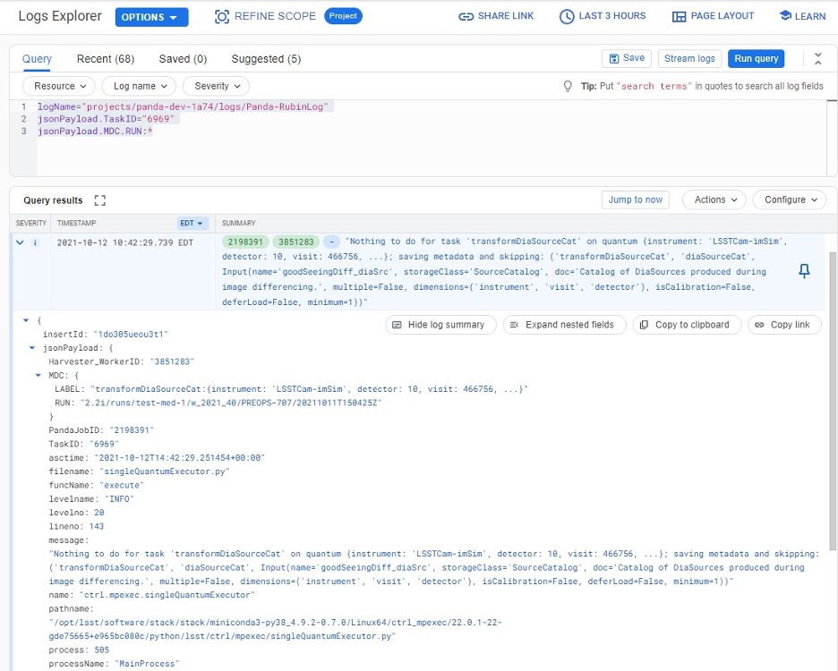

How to monitor workflows
========================

There are different views provided by PanDA monitor to navigate over the
workflow computation progress. The PanDA monitor can show the details in
different levels:

- **Workflow**. The workflow progress shows the processing state for the
  entire execution graph. One workflow is one user request, which can includes
  multiple tasks.

- **Task**. One task perform the unique kind of data processing against
  a range of data. This is the example of some tasks in the Rubin workflow:
  measure, forcedPhotCcd,mergeMeasurements, writeObjectTable, consolidateObjectTable,
  visit_detector, coadd, diffim, forced_phot, etc.

- **Job**. One task can includes multiple jobs. One job is an execution payload,
  which normally is an execution unit in a batch system. Jobs in one task normally
  has the same execution instrutions but with different input data. In Rubin,
  the input data is marked as pseudo input files, which encode the quantum graph
  file and the data node id to be processed.

The primary monitoring tool used with the test PanDA setup is available
on this address::

    https://usdf-panda-bigmon.slac.stanford.edu:8443  (USDF PanDA)

First-time access may require adding this site to the secure exception
list, this happens because the site SSL certificate has been signed by
the CERN Certification Authority. The inner views of this website
require authentication, then Google or GitHub authentication is the
easiest way to do this.

Workflow progress
-----------------

The workflow summary is available on this address::

    https://usdf-panda-bigmon.slac.stanford.edu:8443/idds/wfprogress (USDF PANDA)

(Follow instructions on
https://cafiles.cern.ch/cafiles/certificates/list.aspx?ca=grid and
install CERN Grid certification Authority in the browser)

Fig 3. Screenshot of the Workflow progress view

This page provides an overview of the workflow progress::

   -  requst_id is the number of the workflow in the iDDS server

   -  created_at is the time when the workflow was submitted in the iDDS
      server. Time provided in the UTC time zone.

   -  total_tasks is the number of tasks used for grouping jobs of the same
      functional role

   -  tasks column provides link to tasks in different status

   -  all rest columns provides count of input files in different statuses

Once a new workflow has submitted it can take about 20 minutes to appear
in the workflow monitoring

Tasks progress
--------------

Tasks view provides more detailed information about statuses of tasks in
the workflow. There are different ways how such a list of tasks could be
retrieved. One of the ways is to drill down using the link provided in
the WorkFlow progress view described earlier. Another way is to use the
workflow name, e.g.::

    https://usdf-panda-bigmon.slac.stanford.edu:8443/tasks/?name=shared_pipecheck_20210525T115157Z*

This view displays a short summary of tasks, its statuses and progress.
For example, a line of the summary table shown in the fig 4.

Fig 4. Example of the task summary on the tasks view

In this line the first column is the task id in the PanDA system linked
to a task detailed view. The second column provides the task name. There
is a message displayed here: “insufficient inputs are ready. 0 files
available, 1*1 files required” this means that not all pseudo inputs
(data ids) for this task are released because the previous steps are not
yet finished and currently this task has no unprocessed inputs. The
third column shows the task status and number of pseudo inputs (data
ids) registered for this task. Each data input corresponds to a unique
job to be submitted in the computation cluster. In this case the task
unites 1180 jobs. The third column shows the overall completion progress
(84% or 1001 jobs) and the failure rate (9% or 64 jobs).

Following columns used for the system debug.

Jobs progress
-------------

Clicking on the task id or its name on the tasks view the detailed
information is loaded, as shown on the fig. 5:

Fig 5. Task details

Here one can see several tables, one of the most important is the jobs
summary. In this table all jobs of the task are counted and grouped by
their statuses. Since PanDA uses late jobs generation, a job is
generated only when the next available input is released.

There are two retry filtration modes supported: drop and non drop. They
could be switched by clicking the correspondent link in the table head.
The drop mode hides all failed jobs which were successfully retried and
shows only failures which are hopeless or not yet addressed by the retry
module. The drop mode is the default one. The non drop mode shows every
failure regardless if they were retried. It could be directly specified
in the query URL as follows::

    https://usdf-panda-bigmon.slac.stanford.edu:8443/task/<taskid>/?mode=nodrop

Logs access
-----------

PanDA monitor provides central access to logs generated by running jobs(providing
links to the log system). A log becomes accessible when a job is in the final state - e.g.
finished or failed. For Rubin, logs are transferred to
the object store and then available for download from there. There are 2
kinds of job logs available: the Rubin software output and the Pilot log
which arrange the job run on the computation node. (The pilot log is mainly
for system administrators to understand system issues when something doesn't
work. Normally users don't need to dig it. Users normally only need to check
the payload stdout and stderr.)

To access the job log one should load the job details page first. It is
accessible as::

    https://usdf-panda-bigmon.slac.stanford.edu:8443/job/<jobid>/

The job page could be also navigated starting from the task page::

    task - > list of jobs in particular state -> job

Once a job page has landed a user should click: Logs -> Pilot job
stderr. This will download the Rubin SW output.

Real-time logs access
---------------------

**This part requires users having lsst.cloud accounts.**

The Rubin jobs on the PanDA queues are also provided with
(near)real-time logging on Google Cloud Logging. Once the jobs have been
running on the PandDA queues, users can check the json format job logs
on `the Google Logs Explorer <https://console.cloud.google.com/logs>`__.
To access it, you need to login with your Google account of
**lsst.cloud**, and select the project of "**panda-dev**" (the full name
is panda-dev-1a74).

On the Google Logs Explorer, you make the query. Please include the
logName **Panda-RubinLog** in the query:

For specific PanDA task jobs, you can add one field condition on
**jsonPayload.TaskID** in the query, such as:

For a specific individual panda job, you can include the field
**jsonPayload.PandaJobID**. Or search for a substring "Importing" in the
log message:

Or ask for logs containing the field "**MDC.RUN**":

You will get something like:

You can change the time period from the top panel. The default is the
last hour. And you can also pull down the **Configure** menu (on the
middle right) to change what to be displayed on the Summary column of
the query result.

There are more fields available in the query. As you are typing in the
query window, it will show up autocomplete field options for you.

You can visit `the page of Advanced logs
queries <https://cloud.google.com/logging/docs/view/advanced-queries>`__
for more details on the query syntax.

Monitor of job resource utilization
-----------------------------------

For finished and some failed jobs PanDA monitor offers a set of plots
with various job metrics collected by the
`prmon <https://github.com/HSF/prmon>`__ tool embedded to the user payload.
To open that plots user should click on the “Memory and IO plots” button
placed on a job view like shown on the fig.7 and open the popup link.

Fig 7. “Memory and IO plots” button

Prmon logs are also available in the textual form. Correspondent links
are available in the “Logs” block of the menu.

How to debug a workflow
-----------------------

Workflow points of inspection
~~~~~~~~~~~~~~~~~~~~~~~~~~~~~

Different metrics could be inspected to check workflow progress and
identify possible issues. There are few of them::

  -  Is the workflow properly submitted? This could be checked looking
      into the https://usdf-panda-bigmon.slac.stanford.edu:8443/idds/wfprogress/ table. If the
      workflow with id provided during submission is in the table, then
      it went into the iDDS/PanDA systems.

  -  Are there any failures not related to node preemption? To check this
      user should list failed jobs and check type of occurred errors:

  ..

  https://usdf-panda-bigmon.slac.stanford.edu:8443/jobs/?jeditaskid=\ <task>&jobstatus=failed

Workflow cancel/retry
~~~~~~~~~~~~~~~~~~~~~

If the BPS_WMS_SERVICE_CLASS is not set, set it through::

   $> export BPS_WMS_SERVICE_CLASS=lsst.ctrl.bps.panda.PanDAService

To abort the entire workflow the following command could be used::

   $> bps cancel --id <workflowid>

If there are many failed jobs or tasks in a workflow, the restart command could
be applied to the whole workflow to reactivate the failed jobs and tasks::

   $> bps restart  --id <workflowid>

**(When `bps restart` is called to PanDA service, the activities that PanDA does is
to retry the workflow. When retrying a workflow, all finished tasks and jobs will
not be touched. If the workflow is still running, retrying will re-activate the
failed tasks and jobs to rerun them (The queuing or running jobs will not be affected).
If the workflow is terminated, retrying will re-activate all unfinished tasks and
jobs. From the monitoring view, all monitor pages will be the same. The only difference
should be that the number of retries is increased.)**
